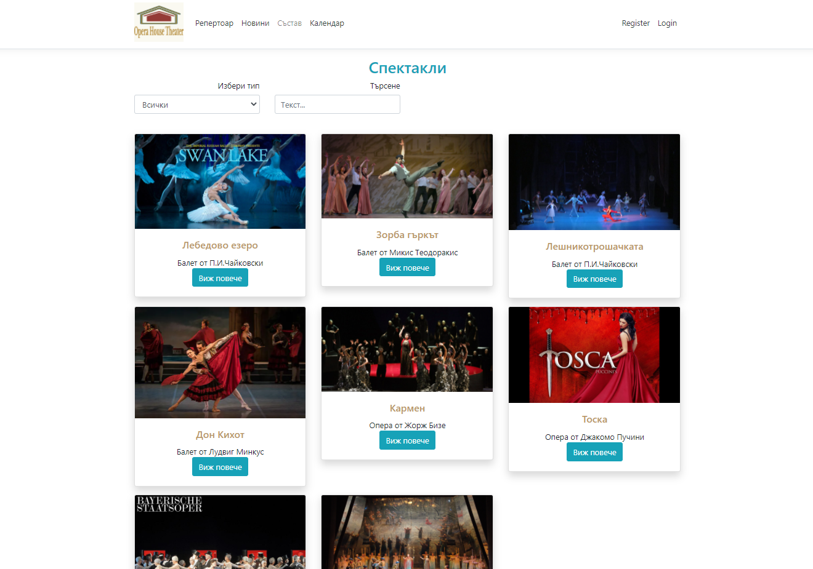

  

## 🚀 My ASP.Net Project
My project was created to defend the C# Web - ASP.Net Core course at SoftUni University.
	It is a platform for opera and ballet. The administrators have the opportunity to add in it:
	new performances to the repertoire, roles for each performance, ballet and opera artists, administrative staff, news
	and upcoming performances in the "OperaHouseTheater" calendar. They can also edit or delete information.
	Unregistered users can have access to information on the site, but only registered users who are also a member
	have the opportunity to buy tickets for upcoming events in the calendar, as well as to 
	leave opinions and comments about the performances.

## Screenshots

## 🛠 DataBase Diagram

  

## Used Frameworks:
- ASP.NetCore
- EF Core
- XUnit
- Moq
- MyTested.AspNetCore.MVC

## Used techniques:
- MVC
- Services
- In-Memmory Cache
- TempData for error messages
- Bootstrap

## Admin Credentials:
- Email: admin@oht.com
- Password: admin123

## License
[MIT](https://choosealicense.com/licenses/mit/)

## Authors
- [@nikola-arnaudov](https://www.github.com/Nikola-Arnaudov)

